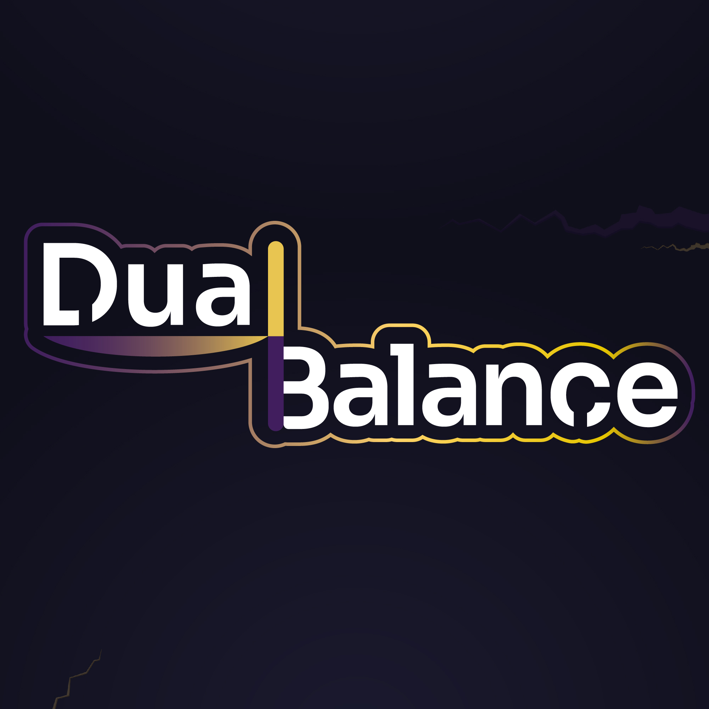

# 🎮 Adhoper Games

**Adhoper Games** is an indie studio focused on creating emotionally driven interactive experiences where gameplay and storytelling come together.

> *Where hope plays.*

---

## 🌱 About Us
Adhoper Games develops games and narrative experiences that explore emotion, decision-making, and the meaning behind the act of playing.

We work on both digital projects and board games, with a creative and personal approach.

---

## 🕹️ Projects

### **Furia Elemental**

A card-based board game focused on strategic combat using elemental mechanics.

> **Format:** Physical board game  
> **Status:** Completed

---

### **Entre Luces y Sombras**

A first-person narrative experience centered on memory, grief, and emotions.

> **Engine:** Unreal Engine 5
> **Platforms:** Windows 
> **Status:** Completed

---

### ⚖️ **Dual Balance**

A 2D endless runner developed in Unity, focused on maintaining the balance between Light and Darkness energies while avoiding obstacles and breaking through elemental walls.

> **Engine:** Unity  
> **Platforms:** Android / Windows  
> **Status:** Released  
> **Available on:** [Google Play](https://play.google.com/store/apps/details?id=com.adhopergames.dualbalance&pcampaignid=web_share) · [itch.io](https://adhopergames.itch.io/dual-balance)

---

## 🛠️ Technologies
- Unity (C#)
- Unreal Engine 5
- Game systems design
- Interactive storytelling
- Gameplay prototyping

---

## 👤 Founder
**Adrian Curet**  
Computer Technologies Engineer  
Web & Game Developer

---

> Building experiences where hope also plays.
